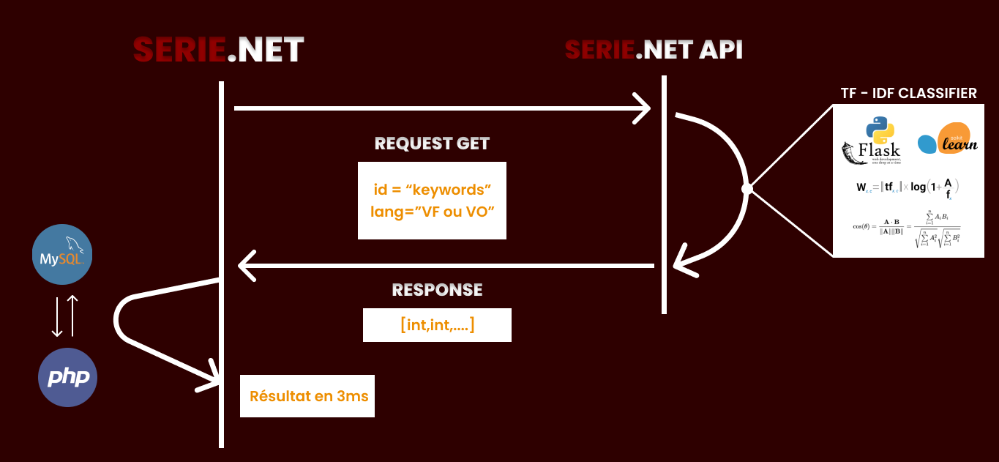
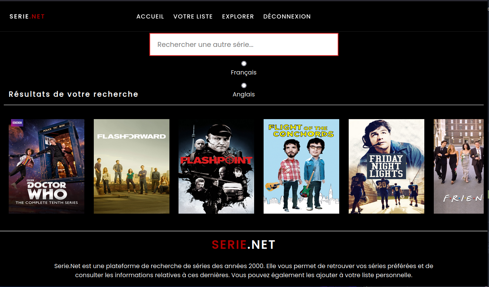
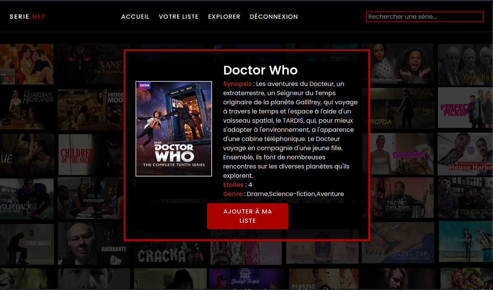
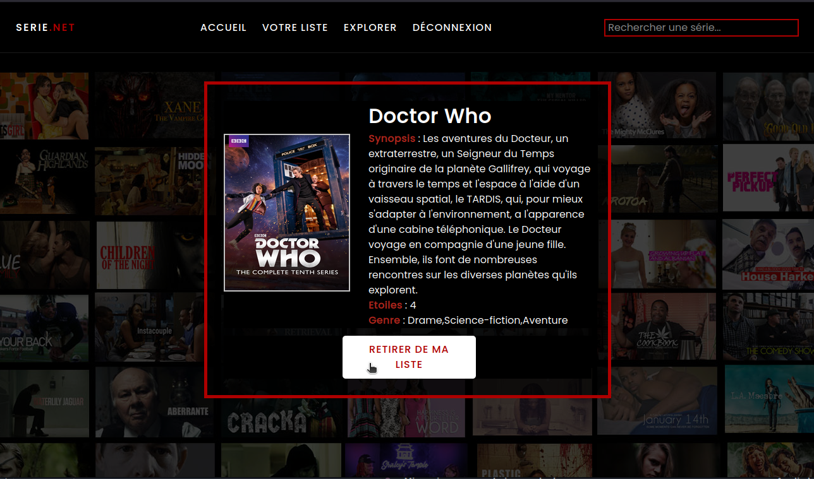
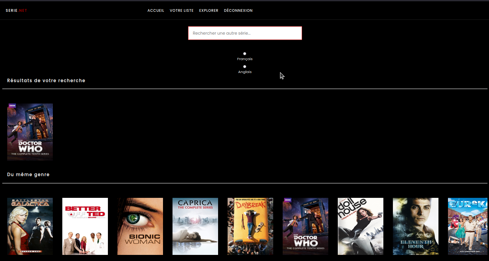
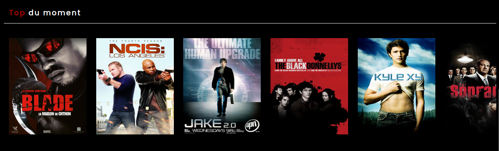
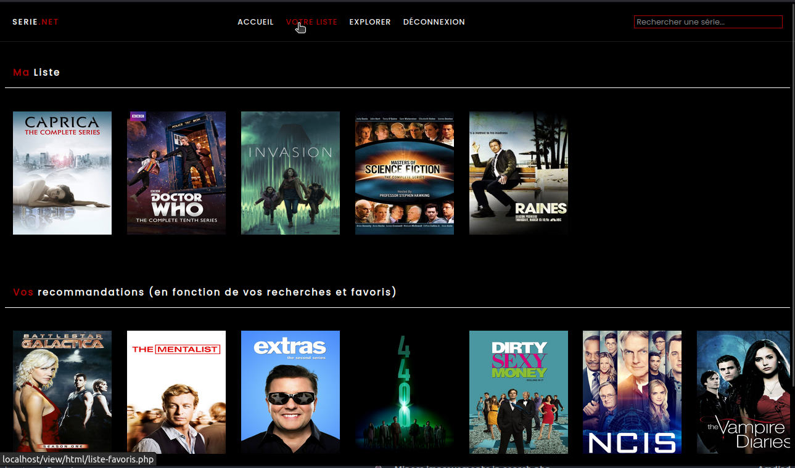

# SERIE NET

---

## Description
**SERIE NET** est une application web permettant de rechercher des séries TV des années 90

# Sommaire

* **[Sommaire](#sommaire)**
* **[Informations](#informations)**
* **[Fonctionnalités](#fonctionnalités)**
* **[Auteurs](#auteurs)**
* **[Crédits](#crédits)**

## Informations

* **Version :** 1.5.0
* **Dernière mise à jour :** 20/10/2021
* **Langages utilisés :**
  * HTML5
  * CSS3
  * JavaScript
  * PHP
  * SQL
  * JSON
* **Base de données :** MySQL
* **Serveur :** Apache
* **API FLASK:** [serieNet API](https://github.com/Maxiwere45/seriesNet)

### Fonctionnent en interne
  

Lorsque l'utilisateur effectue une recherche, l'application PHP envoie une requête
au serveur Flask qui va effectuer une recherhe avec l'algorithme TF-IDF sur les données vectorisées [SOUS-TITRES]. 
Le serveur Flask va ensuite renvoyer les résultats en JSON à l'application PHP qui va effectuer une recherche 
dans la base de données MySQL pour récupérer les informations des séries TV et les afficher à l'utilisateur.

## Fonctionnalités

* **Recherche de séries TV**

### **Affichage des informations de la série**

### **Mise en favoris des séries**

### **Affichage des séries similaires**

### **Affichage des séries populaires**

### **Affichage des séries les mieux notées** `En cours de développement`

### **Recommendation de séries**

## Auteurs

* **Anrifou Amdjad** _alias_ [@Maxiwere45](https://github.com/Maxiwere45)
* **PREMI CARL** _alias_ [@otsubyo](https://github.com/otsubyo)

* Professeurs encadrants :
  * **M. BROISIN JULIEN** _alias_ [@bretonJulien](https://www.linkedin.com/in/jln-brtn/)
  * **M. BRETON JULIEN** _alias_ [@broisinJulien](https://www.linkedin.com/in/jbroisin/)

## Crédits

Ce projet a été réalisé dans le cadre d'un projet scolaire à l'[IUT PAUL SABATIER de Toulouse](https://iut.univ-tlse3.fr/) pour l'année 2023-2024 dans le
parcour [Administration, gestion et exploitation des bases de données](https://iut.univ-tlse3.fr/but-informatique-parcours-administration-gestion-et-exploitation-des-donnees-toulouse) (AGED).