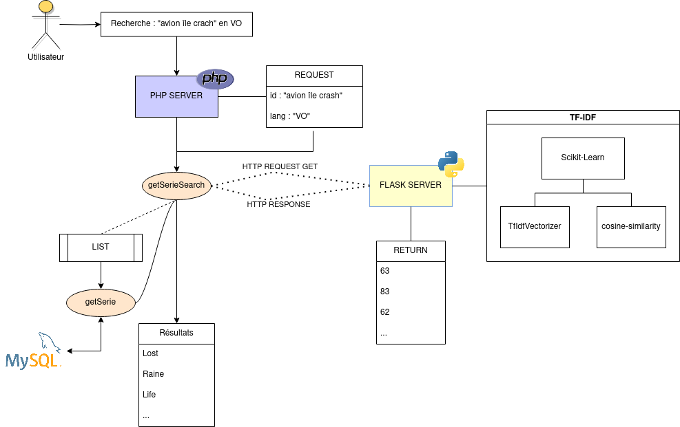

# SERIE NET

---

## Description
**SERIE NET** est une application web permettant de rechercher des séries TV des années 90

# Sommaire

* **[Sommaire](#sommaire)**
* **[Informations](#informations)**
* **[Fonctionnalités](#fonctionnalités)**

## Informations

* **Auteurs :**
  * [**Amdjad Anrifou**](https://github.com/maxiwere45)
  * [**Carl Premi**](https://github.com/otsubyo)

* **Version :** 1.0.0
* **Dernière mise à jour :** 20/10/2021
* **Langages utilisés :**
  * HTML5
  * CSS3
  * JavaScript
  * PHP
  * SQL
  * JSON

* Fonctionnement
  * **Base de données :** MySQL
  * **Serveur :** Apache
  * **API :** [serieNet API](https://github.com/otsubyo/SerieNet)

### Fonctionnent avec l'API serieNet API
  

## Fonctionnalités

* **Recherche de séries TV**
* **Affichage des informations de la série**
* **Mise en favoris des séries**
* **Affichage des séries similaires**
* **Affichage des séries populaires**
* **Affichage des séries les mieux notées**
* **Recommendation de séries**